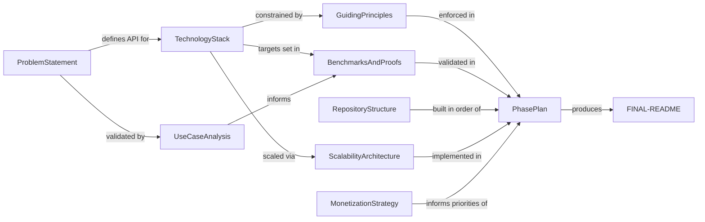

# Documentation Summary

This is the index of all HEBBS documentation. Every document has a specific purpose and a defined scope. Before making changes, read this summary to find the right document to update.

---

## Document Map

| Document | Purpose | Scope |
|----------|---------|-------|
| [ProblemStatement.md](ProblemStatement.md) | Why HEBBS exists | Problem definition, market gap, requirements, API design rationale |
| [TechnologyStack.md](TechnologyStack.md) | How HEBBS is built | Language, storage engine, indexes, embedding, protocols, architecture diagram |
| [GuidingPrinciples.md](GuidingPrinciples.md) | Rules for building HEBBS | 12 non-negotiable engineering principles with priority ordering |
| [BenchmarksAndProofs.md](BenchmarksAndProofs.md) | What HEBBS must prove | Latency targets, scalability curves, cognitive benchmarks, outcome metrics |
| [ScalabilityArchitecture.md](ScalabilityArchitecture.md) | How HEBBS scales | Cloud bottlenecks and solutions, edge constraints, sync protocol, fleet mode |
| [RepositoryStructure.md](RepositoryStructure.md) | Where the code lives | 6 repos, crate layout, what goes where and why |
| [PhasePlan.md](PhasePlan.md) | Build sequence | 18 dependency-ordered phases from zero to production |
| [UseCaseAnalysis-VoiceSalesAgent.md](UseCaseAnalysis-VoiceSalesAgent.md) | Real-world validation | Maps all 9 operations to a voice sales agent workflow |
| [MonetizationStrategy.md](MonetizationStrategy.md) | Business model | Open core, managed cloud, enterprise, licensing (BSL) |
| [FINAL-README-WHEN-DONE.md](FINAL-README-WHEN-DONE.md) | Public README | The polished README to publish when the project ships |
| [phases/](phases/) | Phase implementation blueprints | Detailed architecture plans per phase (see below) |

---

## Document Details

### ProblemStatement.md

Defines the core problem HEBBS solves: current memory solutions for AI agents are storage-focused, not cognition-focused. Covers:

- The gap between pre-AI infrastructure primitives (Postgres, Redis, Kafka) and the current "framework-first" AI era
- Limitations of conversation history, vector DBs, KV stores, and knowledge graphs
- Five requirements for an agentic memory primitive: importance-driven encoding, multi-path recall, episodic-to-semantic consolidation, decay/reinforcement, revision over append
- The proposed 9-operation API (`remember`, `recall`, `revise`, `forget`, `prime`, `subscribe`, `reflect_policy`, `reflect`, `insights`)
- The three callers of `recall` (framework, agent, primitive itself)
- Why `reflect` is a background policy, not a function call

**Update when:** the API surface changes, new operations are added, or the core problem framing evolves.

---

### TechnologyStack.md

Specifies every technology choice and its rationale. Covers:

- Design principles: extreme performance, deployment simplicity, predictable resources
- Rust (language), RocksDB (storage), HNSW/B-tree/Graph (indexes), ONNX (embedding), gRPC (protocol)
- Three index types mapped to four recall strategies
- Reflection pipeline: clustering (Rust) + proposal (LLM) + validation (LLM) + consolidation
- Three deployment modes: standalone server, embedded library, edge
- Architecture diagram showing all components

**Update when:** a technology choice changes (e.g., different embedding runtime), a new component is added to the architecture, or deployment modes change.

---

### GuidingPrinciples.md

The 12 non-negotiable engineering principles that govern every decision. Covers:

1. Hot Path Sanctity -- latency budgets as contracts, no network calls on hot path
2. Single Process, Zero Dependencies -- one binary, instant startup
3. Cognition, Not Storage -- every feature must make agents smarter
4. Bounded Everything -- configurable limits on all resources
5. Background Intelligence, Foreground Speed -- the hot path / background wall
6. Lineage Is the Moat -- every insight traceable to source memories
7. Same API, Different Internals -- edge/cloud parity via config
8. Memories Are Events, Not State -- append-only, conflict-free sync
9. Measure Everything, Regress Nothing -- CI benchmarks, soak tests
10. API Elegance Over Feature Count -- 9 operations, 3 groups, resist growth
11. Correctness Before Performance -- atomic writes, crash safety, async by design
12. Secure by Default -- structural tenant isolation, real deletion, auth on by default

Priority ordering for conflict resolution is defined (correctness > security > latency > ...).

**Update when:** a principle is added, refined, or the priority ordering changes.

---

### BenchmarksAndProofs.md

Defines the quantitative targets HEBBS must hit. Covers:

- Systems benchmarks: latency targets per operation (remember < 5ms p99, recall similarity < 10ms p99, etc.)
- Scalability curve: latency at 100K, 1M, 10M, 100M memories
- Resource efficiency: RAM, disk, bytes per memory, embedding latency
- Cognitive benchmarks: multi-path recall precision vs similarity-only (temporal +68%, causal +63%, analogical +43%)
- Reflection effectiveness: compression ratio, insight accuracy, recall precision improvement
- Decay effectiveness: precision improvement (61% to 84%), latency improvement (12ms to 7ms)
- Agent outcome metrics: voice sales +133% conversion, support +45% FCR, coding +30% resolution
- Competitive comparisons: 4 services vs 1, 2000 lines vs 50, 50-200ms vs <20ms
- Reliability proofs: 72-hour soak test, chaos test, public benchmark suite, security audit

**Update when:** benchmark targets change, new benchmarks are added, or actual measured results are recorded.

---

### ScalabilityArchitecture.md

Addresses how HEBBS handles scale in two environments. Covers:

- Cloud-scale bottlenecks and solutions:
  - HNSW growth: tenant sharding, tiered storage (HOT/WARM/COLD), product quantization
  - Write throughput: decoupled pipeline (WAL ack + async indexing), batch embedding
  - Reflect contention: hash-based staggering, priority queues, incremental processing
  - Subscribe fan-out: hierarchical filtering (bloom + coarse + fine)
  - Causal graph depth: bounded traversal, materialized summaries
- Edge bottlenecks and solutions:
  - Local reflection: on-device LLMs (Phi-3, Gemma-2B, Llama-3-8B)
  - Embedding latency: hardware acceleration (Neural Engine, GPU, NPU)
  - Index size: 384-dim default, memory-mapped HNSW, aggressive decay
  - Offline sync: append-only for memories, conflict rules for revise/forget/insights
  - Fleet coherence: shared namespace, gossip protocol
- The hardest unsolved problem: causal consistency of reflected insights across sync boundaries (lineage tracking solution)

**Update when:** new bottlenecks are identified, solutions change, sync protocol evolves, or edge device targets change.

---

### RepositoryStructure.md

Defines the 6 repositories and the internal crate layout. Covers:

- `hebbs` (Rust workspace monorepo): 11 crates (core, index, storage, embed, reflect, server, proto, client, ffi, cli, bench)
- `hebbs-python`: PyO3/maturin + gRPC, LangChain/CrewAI integrations
- `hebbs-node`: TypeScript gRPC + REST client
- `hebbs-go`: Go gRPC client
- `hebbs-docs`: documentation website
- `hebbs-deploy`: Helm, Terraform, Docker, monitoring
- What not to split into separate repos (proto, benchmarks, CLI)

**Update when:** a repo is added or removed, crate structure changes, or new SDK targets are added.

---

### PhasePlan.md

The 18-phase build sequence from empty directory to production. Covers:

- Phases 1-3: Storage, embedding, indexes (foundation)
- Phases 4-6: Recall, revise/forget/decay, subscribe (complete API)
- Phase 7: Reflection pipeline
- Phase 8: gRPC server
- Phase 9: CLI client (interactive REPL + one-shot commands)
- Phase 10: Rust client SDK, FFI
- Phase 11: Python SDK
- Phases 12-13: Testing/benchmarks, production hardening
- Phase 14: Reference app and LLM integration
- Phases 15-16: Deployment configs, documentation site
- Phase 17: Edge mode and sync
- Phases 18-19: TypeScript and Go SDKs
- Dependency graph (mermaid) and deliverable table per phase

Each phase has: goal, work items, and "done when" criteria. Governed by GuidingPrinciples.md.

**Update when:** phases are completed, reordered, split, or new phases are added. Mark completed phases.

---

### UseCaseAnalysis-VoiceSalesAgent.md

Maps the HEBBS API to a concrete real-world workflow. Covers:

- The sales agent lifecycle: before, during, after calls, and over time
- `remember`: importance scoring on call signals (urgency, tone shifts, noise filtering)
- `recall` four strategies applied to sales: temporal (prospect history), causal (deal loss analysis), analogical (cross-industry pattern transfer), similarity (objection handling)
- `reflect`: consolidating 500 calls into playbook knowledge
- `revise`: updating beliefs when pricing/product/competitive landscape changes
- `forget`: pruning stale urgency signals, outdated intel, GDPR compliance
- The compound effect: how the agent improves call-over-call

**Update when:** new use case analyses are written (create new files following this pattern), or the API operations change in ways that affect the mapping.

---

### MonetizationStrategy.md

Defines the business model. Covers:

- Open source flywheel: core engine fully open, $0 revenue, market dominance play
- Managed cloud (primary business): usage-based meters (memories stored, recall queries, reflect cycles)
- The "reflect wedge": bundled LLM inference as the conversion driver
- Enterprise: multi-tenant isolation, SSO/RBAC, GDPR/HIPAA, data residency, VPC/on-prem, custom reflection models
- Insights economy: analytics dashboard, insight API, optimization advisory
- Licensing: Business Source License (BSL) -- free for devs, prohibits managed service for 3 years, converts to Apache 2.0
- Go-to-market phases: OSS release, cloud beta, enterprise push, platform scale

**Update when:** pricing model changes, new revenue streams are identified, licensing terms change, or GTM strategy evolves.

---

### FINAL-README-WHEN-DONE.md

The public-facing README to ship with the project. Covers:

- Tagline, quick start (install, connect, first operations)
- Full API reference (9 operations, 3 groups)
- Four recall strategies with examples
- Performance benchmarks (systems, scalability, cognitive, agent outcomes)
- Architecture diagram and tech stack
- Deployment modes (standalone, embedded, edge, cloud)
- Client libraries (Python, TypeScript, Rust, Go)
- Use cases (voice sales, support, coding, research, robotics, personal assistants)
- Competitive comparison ("why not pgvector/Qdrant/Redis/Neo4j")
- Repository structure overview

**Update when:** any user-facing information changes. This is the last document to update -- it should reflect the final shipped state of the product.

---

### phases/ Directory

The `phases/` subdirectory contains detailed architecture blueprints for each phase of the build plan. These are the implementation-level documents that an engineer reads before writing code for a specific phase.

| Document | Phase | Covers |
|----------|-------|--------|
| [phases/phase-01-storage-foundation.md](phases/phase-01-storage-foundation.md) | Phase 1 (complete) | Workspace structure, Memory data model, serialization format (bitcode), RocksDB column families, key encoding, storage trait, error taxonomy, concurrency model, RocksDB tuning, testing strategy, risk register |
| [phases/phase-02-embedding-engine.md](phases/phase-02-embedding-engine.md) | Phase 2 (complete) | Embedder trait, ONNX Runtime integration, model selection (BGE-small-en-v1.5, 384-dim), tokenizer coupling, hardware acceleration, batch amortization, L2 normalization invariant, model distribution, pluggable providers, remember() pipeline change, memory footprint |
| [phases/phase-03-index-layer.md](phases/phase-03-index-layer.md) | Phase 3 (complete) | Three index implementations (temporal B-tree, HNSW vector, graph adjacency), unified index manager, atomic multi-CF WriteBatch writes, HNSW persistence and crash recovery, graph bidirectional key encoding, tombstone-based delete, memory footprint analysis, startup rebuild, SIMD distance design |
| [phases/phase-04-recall-engine.md](phases/phase-04-recall-engine.md) | Phase 4 (complete) | Four recall strategies (similarity, temporal, causal, analogical), multi-strategy parallel execution and merge, composite scoring formula, prime() operation, reinforcement on recall, partial-failure semantics, structural similarity for analogical recall |
| [phases/phase-05-write-path-completion.md](phases/phase-05-write-path-completion.md) | Phase 5 (complete) | revise() with predecessor snapshots, forget() with criteria-based deletion and tombstones, decay engine with background worker, auto-forget pipeline, GDPR proof-of-deletion, corrected reinforcement-weighted decay formula |
| [phases/phase-06-subscribe.md](phases/phase-06-subscribe.md) | Phase 6 (complete) | subscribe() continuous query with bidirectional text-in/memory-out streaming, hierarchical filtering pipeline (bloom → coarse centroid → fine HNSW), text chunk accumulation, per-session deduplication, backpressure, new-write notification, subscription lifecycle management |
| [phases/phase-07-reflection-pipeline.md](phases/phase-07-reflection-pipeline.md) | Phase 7 (complete) | reflect() four-stage pipeline (cluster → propose → validate → consolidate), LlmProvider trait with Anthropic/OpenAI/Ollama/Mock implementations, reflect_policy() background triggers, insights() filtered recall, lineage via InsightFrom graph edges, insight invalidation, cluster centroid publication for subscribe |
| [phases/phase-08-grpc-server.md](phases/phase-08-grpc-server.md) | Phase 8 (complete) | Protobuf schema for all 9 operations, tonic gRPC server, axum HTTP/REST server, TOML+env+CLI configuration, structured logging (tracing), Prometheus metrics, health checks, graceful shutdown, async-sync bridge (spawn_blocking), subscribe server-streaming, error mapping to gRPC/HTTP status codes |
| [phases/phase-09-cli-client.md](phases/phase-09-cli-client.md) | Phase 9 (complete) | CLI binary crate design, unified command dispatch (one-shot + REPL), async runtime strategy, connection lifecycle, REPL architecture (rustyline + tab completion + dot-commands), subscribe streaming UX, output rendering (human/JSON/raw), ULID memory ID representation, diagnostic commands (status/get/inspect/export/metrics), error presentation and exit codes, pipe/stdin integration, CLI configuration |
| [phases/phase-10-rust-client-ffi.md](phases/phase-10-rust-client-ffi.md) | Phase 10 (complete) | Two-crate architecture (hebbs-client + hebbs-ffi), async Rust client SDK with builder pattern and retry policies, ergonomic domain types (Ulid IDs, Rust enums), gRPC proto-to-domain conversion, structured ClientError taxonomy, subscribe stream via SubscribeHandle, C-ABI FFI with opaque handle pattern (Arc<Engine>), JSON data exchange, thread-local error reporting, callback + polling subscribe model, C header file, concurrent thread safety |

Each phase blueprint follows the same structure: intent, scope boundaries, architectural decisions with tradeoffs, risk register, deliverables checklist, and published interfaces for downstream phases.

**Update when:** a new phase blueprint is created, or an existing blueprint's architectural decisions change during implementation.

---

## Cross-References

### Reading Order for New Contributors

1. **ProblemStatement.md** -- understand why
2. **TechnologyStack.md** -- understand how
3. **GuidingPrinciples.md** -- understand the rules
4. **BenchmarksAndProofs.md** -- understand the bar
5. **PhasePlan.md** -- understand what to build next
6. **RepositoryStructure.md** -- understand where code goes
