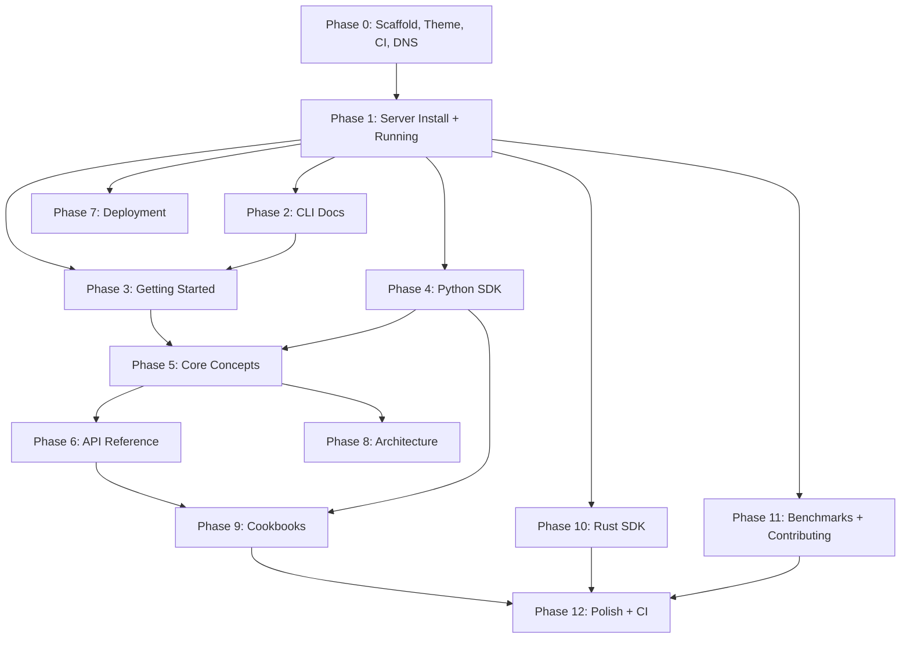

# HEBBS Documentation Portal -- Master Plan

> **Framework:** Astro Starlight  
> **Deployment:** GitHub Pages at `docs.hebbs.ai`  
> **Repo:** `hebbs-docs` (new folder in workspace, will become its own GitHub repo)

---

## Repo Structure

```
hebbs-docs/
├── .github/
│   └── workflows/
│       ├── deploy.yml                  # Build + deploy to GitHub Pages on push to main
│       └── verify-examples.yml         # CI: test all runnable examples against a real server
├── astro.config.mjs
├── package.json
├── tsconfig.json
├── CNAME                               # docs.hebbs.ai
│
├── public/
│   ├── favicon.svg                     # HEBBS logo (from hebbs-website)
│   └── og-image.png                    # Social preview
│
├── src/
│   ├── assets/                         # Images, diagrams, screenshots
│   │   ├── logo-dark.svg
│   │   ├── logo-light.svg
│   │   ├── architecture-overview.png
│   │   ├── recall-strategies.png
│   │   ├── reflection-pipeline.png
│   │   └── cli-repl-screenshot.png
│   │
│   ├── content/
│   │   └── docs/                       # All Starlight docs live here
│   │       ├── index.mdx               # Welcome / landing
│   │       │
│   │       ├── getting-started/
│   │       │   ├── introduction.mdx
│   │       │   ├── quickstart.mdx
│   │       │   ├── installation.mdx
│   │       │   └── key-concepts.mdx
│   │       │
│   │       ├── server/
│   │       │   ├── running.mdx
│   │       │   ├── configuration.mdx
│   │       │   └── health-metrics.mdx
│   │       │
│   │       ├── concepts/
│   │       │   ├── memory-model.mdx
│   │       │   ├── recall-strategies.mdx
│   │       │   ├── importance-decay.mdx
│   │       │   ├── reflection-insights.mdx
│   │       │   ├── entity-isolation.mdx
│   │       │   ├── lineage-edges.mdx
│   │       │   └── subscribe-realtime.mdx
│   │       │
│   │       ├── api/
│   │       │   ├── overview.mdx
│   │       │   ├── remember.mdx
│   │       │   ├── recall.mdx
│   │       │   ├── revise.mdx
│   │       │   ├── forget.mdx
│   │       │   ├── prime.mdx
│   │       │   ├── subscribe.mdx
│   │       │   ├── reflect-policy.mdx
│   │       │   ├── reflect.mdx
│   │       │   ├── insights.mdx
│   │       │   ├── protobuf-schema.mdx
│   │       │   ├── rest-endpoints.mdx
│   │       │   └── error-codes.mdx
│   │       │
│   │       ├── python/
│   │       │   ├── overview.mdx
│   │       │   ├── installation.mdx
│   │       │   ├── quickstart.mdx
│   │       │   ├── client-reference.mdx
│   │       │   ├── types-reference.mdx
│   │       │   ├── error-handling.mdx
│   │       │   └── subscribe-streaming.mdx
│   │       │
│   │       ├── cli/
│   │       │   ├── overview.mdx
│   │       │   ├── installation.mdx
│   │       │   ├── commands.mdx
│   │       │   ├── repl.mdx
│   │       │   └── output-formats.mdx
│   │       │
│   │       ├── rust-sdk/
│   │       │   ├── overview.mdx
│   │       │   ├── quickstart.mdx
│   │       │   ├── client-reference.mdx
│   │       │   └── ffi.mdx
│   │       │
│   │       ├── deployment/
│   │       │   ├── overview.mdx
│   │       │   ├── docker.mdx
│   │       │   ├── kubernetes.mdx
│   │       │   ├── terraform-aws.mdx
│   │       │   ├── monitoring.mdx
│   │       │   └── production-checklist.mdx
│   │       │
│   │       ├── architecture/
│   │       │   ├── overview.mdx
│   │       │   ├── storage.mdx
│   │       │   ├── embedding.mdx
│   │       │   ├── indexes.mdx
│   │       │   ├── reflection-pipeline.mdx
│   │       │   └── scalability.mdx
│   │       │
│   │       ├── cookbooks/
│   │       │   ├── index.mdx
│   │       │   ├── first-memory-agent.mdx
│   │       │   ├── multi-strategy-recall.mdx
│   │       │   ├── entity-scoped-memory.mdx
│   │       │   ├── voice-sales-agent.mdx
│   │       │   ├── customer-support.mdx
│   │       │   ├── gdpr-compliance.mdx
│   │       │   ├── realtime-subscribe.mdx
│   │       │   ├── background-learning.mdx
│   │       │   ├── research-assistant.mdx
│   │       │   ├── causal-chains.mdx
│   │       │   └── monitoring-stack.mdx
│   │       │
│   │       ├── benchmarks/
│   │       │   ├── targets.mdx
│   │       │   ├── scalability.mdx
│   │       │   ├── cognitive.mdx
│   │       │   └── running.mdx
│   │       │
│   │       └── contributing/
│   │           ├── development.mdx
│   │           ├── architecture-guide.mdx
│   │           ├── principles.mdx
│   │           └── cla.mdx
│   │
│   └── styles/
│       └── custom.css                  # HEBBS brand overrides
│
├── examples/                           # Runnable companion code for cookbooks + SDK docs
│   ├── README.md
│   ├── quickstart/
│   │   └── quickstart.py
│   ├── multi-strategy-recall/
│   │   └── multi_strategy.py
│   ├── entity-scoped/
│   │   └── entity_scoped.py
│   ├── voice-sales-agent/
│   │   └── sales_agent.py
│   ├── customer-support/
│   │   └── support_agent.py
│   ├── gdpr-compliance/
│   │   └── gdpr_forget.py
│   ├── realtime-subscribe/
│   │   └── subscribe_demo.py
│   ├── background-learning/
│   │   └── reflect_demo.py
│   ├── causal-chains/
│   │   └── causal_demo.py
│   ├── monitoring-stack/
│   │   ├── docker-compose.yml
│   │   └── README.md
│   └── rust-quickstart/
│       ├── Cargo.toml
│       └── src/main.rs
│
└── scripts/
    ├── verify-all.sh                   # Master script: start server, run all examples, report
    └── generate-proto-docs.sh          # Generate protobuf reference from .proto files
```

---

## Exhaustive Task List (Ordered by Dependencies)

### Phase 0: Infrastructure

| # | Task | What to do | Verified when |
|---|------|-----------|---------------|
| 0.1 | Scaffold Starlight project | `npm create astro@latest -- --template starlight` in `hebbs-docs`, configure `astro.config.mjs` with sidebar structure, site URL `https://docs.hebbs.ai` | `npm run dev` shows working site locally |
| 0.2 | Custom theme | Create `src/styles/custom.css` with HEBBS brand: `#0A0A0B` bg, `#F59E0B` accent, Inter/JetBrains Mono/Space Grotesk fonts. Override Starlight CSS variables. Add logos to `src/assets/` | Site matches hebbs.ai look and feel |
| 0.3 | GitHub repo + Actions | Create `hebbs-docs` repo, add `.github/workflows/deploy.yml` for GitHub Pages | Push to main triggers build, site live at `docs.hebbs.ai` |
| 0.4 | DNS setup | Add CNAME record: `docs.hebbs.ai` -> GitHub Pages URL | `curl -I https://docs.hebbs.ai` returns 200 |
| 0.5 | Examples directory | Create `examples/` with `README.md` explaining how to run examples, `requirements.txt` pinning `hebbs` SDK | `pip install -r requirements.txt` works |

### Phase 1: Server + Installation

| # | Task | What to do | Verified when |
|---|------|-----------|---------------|
| 1.1 | getting-started/installation.mdx | Document all install methods: curl installer, Docker, from source. Verify each method step by step | Each method gets a running `hebbs-server` from scratch |
| 1.2 | server/running.mdx | Document starting the server, default ports (gRPC 6380, HTTP 6381), verify health, basic TOML config | `curl localhost:6381/v1/health` returns healthy after following the doc |
| 1.3 | server/configuration.mdx | Document every TOML key from `hebbs-deploy/examples/production.toml`, env var overrides, CLI flag overrides | Every config key has description, type, default, example |
| 1.4 | server/health-metrics.mdx | Document `/v1/health` and `/v1/metrics` endpoints, Prometheus metric names | `curl` output matches documented metrics |

### Phase 2: CLI

| # | Task | What to do | Verified when |
|---|------|-----------|---------------|
| 2.1 | cli/installation.mdx | Document installing `hebbs-cli` (comes with curl installer, or `cargo install`) | `hebbs-cli --version` works |
| 2.2 | cli/commands.mdx | Document every command with examples and expected output: `remember`, `recall`, `revise`, `forget`, `prime`, `reflect`, `insights`, `subscribe`, `status`, `get`, `inspect`, `export`, `metrics` | Every example runs and produces documented output |
| 2.3 | cli/repl.mdx | Document REPL mode, tab completion, dot-commands (`.help`, `.status`, `.clear`), session management | Screenshots/output match what users see |
| 2.4 | cli/output-formats.mdx | Document `--format human`, `--format json`, `--format raw`, piping to `jq` | Each format example works |
| 2.5 | cli/overview.mdx | Intro page linking to the above | Links work, reads well |

### Phase 3: Getting Started

| # | Task | What to do | Verified when |
|---|------|-----------|---------------|
| 3.1 | getting-started/introduction.mdx | What is HEBBS, the problem it solves, 9 operations overview | Reads well, no internal jargon |
| 3.2 | getting-started/quickstart.mdx | 5-minute end-to-end: install, start server, CLI remember+recall, then Python SDK. Copy-pasteable | New developer follows it start to finish in 5 minutes |
| 3.3 | getting-started/key-concepts.mdx | Mental model: memories, importance, entities, tenants, decay, recall strategies (brief), edges | Reader understands enough to use remember/recall meaningfully |
| 3.4 | examples/quickstart/quickstart.py | Companion Python script for the quickstart | `python quickstart.py` runs against local server |
| 3.5 | Welcome landing page (index.mdx) | Hero section, product cards, links to quickstart, SDK docs, cookbooks, API reference | All links work, looks polished |

### Phase 4: Python SDK

| # | Task | What to do | Verified when |
|---|------|-----------|---------------|
| 4.1 | python/installation.mdx | `pip install hebbs`, verify import, version check | `pip install hebbs && python -c "import hebbs"` works |
| 4.2 | python/quickstart.mdx | Connect, remember, recall, display results | Script runs end-to-end against local server |
| 4.3 | python/client-reference.mdx | Every HebbsClient method: signature, params, return type, example. Methods: remember, get, recall, prime, revise, forget, set_policy, subscribe, reflect, insights, health, count | Every snippet runs |
| 4.4 | python/types-reference.mdx | Every type: Memory, MemoryKind, Edge, EdgeType, RecallStrategy, RecallResult, RecallOutput, PrimeOutput, ForgetResult, ReflectResult, SubscribePush, HealthStatus | Types match actual SDK |
| 4.5 | python/error-handling.mdx | HebbsError hierarchy, retry patterns, connection/timeout handling | Example error-handling code catches real errors |
| 4.6 | python/subscribe-streaming.mdx | Subscription object, feed(), async iteration, backpressure, lifecycle | Working subscribe example runs |
| 4.7 | python/overview.mdx | Intro page, design philosophy, links | Links work |

### Phase 5: Core Concepts

| # | Task | What to do | Verified when |
|---|------|-----------|---------------|
| 5.1 | concepts/memory-model.mdx | What a Memory is: content, importance, context, entity_id, edges, timestamps, kind. Diagram | Diagram matches proto definition |
| 5.2 | concepts/recall-strategies.mdx | Deep dive: similarity (HNSW), temporal (B-tree), causal (graph), analogical (structural). Diagrams, when to use each, composite scoring | Each strategy example works via CLI or SDK |
| 5.3 | concepts/importance-decay.mdx | Importance scoring, Hebbian reinforcement, temporal decay formula, half-life, auto-forget | Decay behavior matches docs |
| 5.4 | concepts/reflection-insights.mdx | 4-stage pipeline, what insights look like, lineage | reflect + insights commands produce matching results |
| 5.5 | concepts/entity-isolation.mdx | Entity-scoped memories, tenant isolation, multi-entity patterns | Cross-entity isolation demonstrated |
| 5.6 | concepts/lineage-edges.mdx | Edge types (CausedBy, RelatedTo, FollowedBy, RevisedFrom, InsightFrom), lineage | Graph queries return matching edges |
| 5.7 | concepts/subscribe-realtime.mdx | Bidirectional streaming, hierarchical filtering, confidence thresholds, dedup | Subscribe demo matches description |

### Phase 6: API Reference

| # | Task | What to do | Verified when |
|---|------|-----------|---------------|
| 6.1 | api/overview.mdx | 9 operations, 3 groups, how to access (gRPC + REST) | Accurate |
| 6.2 | api/remember.mdx | gRPC + REST, full request/response, all fields, examples | curl and grpcurl examples work |
| 6.3 | api/recall.mdx | All 4 strategy configs, scoring weights, top_k | All examples work |
| 6.4 | api/revise.mdx | Revision semantics, predecessor snapshots | Works |
| 6.5 | api/forget.mdx | Criteria-based deletion, by entity, by IDs, tombstones | Works |
| 6.6 | api/prime.mdx | Context pre-loading, temporal + similarity blend | Works |
| 6.7 | api/subscribe.mdx | Streaming semantics, feed, close, backpressure | Works |
| 6.8 | api/reflect-policy.mdx | Policy configuration, triggers | Works |
| 6.9 | api/reflect.mdx | Manual trigger, scope | Works |
| 6.10 | api/insights.mdx | Query insights, filters | Works |
| 6.11 | api/protobuf-schema.mdx | Full .proto reference (from hebbs.proto) | Matches actual proto |
| 6.12 | api/rest-endpoints.mdx | All REST endpoints: method, path, request, response | Every endpoint callable via curl |
| 6.13 | api/error-codes.mdx | gRPC status codes, HTTP codes, error taxonomy | Accurate |

### Phase 7: Deployment

| # | Task | What to do | Verified when |
|---|------|-----------|---------------|
| 7.1 | deployment/overview.mdx | Three modes (standalone, embedded, edge) | Accurate |
| 7.2 | deployment/docker.mdx | docker run, docker-compose with HEBBS+Prometheus+Grafana, volumes. Create companion examples/monitoring-stack/docker-compose.yml | docker-compose up starts full stack |
| 7.3 | deployment/kubernetes.mdx | Helm chart install, values reference, scaling, PVC, ingress | Documents Helm install flow accurately |
| 7.4 | deployment/terraform-aws.mdx | AWS EKS deployment via Terraform | Documents terraform apply flow |
| 7.5 | deployment/monitoring.mdx | Prometheus metrics, Grafana dashboard import, alert rules | Dashboard imports correctly |
| 7.6 | deployment/production-checklist.mdx | TLS, auth, resource limits, backup/restore, upgrades | Checklist items are actionable |

### Phase 8: Architecture

| # | Task | What to do | Verified when |
|---|------|-----------|---------------|
| 8.1 | architecture/overview.mdx | System diagram, component map, data flow | Diagram matches architecture |
| 8.2 | architecture/storage.mdx | RocksDB, column families, key encoding, crash safety | Accurate to implementation |
| 8.3 | architecture/embedding.mdx | ONNX Runtime, BGE-small, batch amortization, hardware accel | Accurate |
| 8.4 | architecture/indexes.mdx | HNSW, temporal B-tree, graph adjacency, index manager, WriteBatch | Accurate |
| 8.5 | architecture/reflection-pipeline.mdx | 4-stage pipeline, LLM provider trait, lineage tracking | Accurate |
| 8.6 | architecture/scalability.mdx | Cloud vs edge bottlenecks, sync protocol | Adapted from ScalabilityArchitecture.md |

### Phase 9: Cookbooks

Each cookbook has: Goal, Prerequisites, Step-by-step code, Expected output, What to explore next. Each has a runnable script in `examples/`.

| # | Task | Companion code | Verified when |
|---|------|---------------|---------------|
| 9.1 | cookbooks/first-memory-agent.mdx | examples/quickstart/quickstart.py | Script runs, output matches |
| 9.2 | cookbooks/multi-strategy-recall.mdx | examples/multi-strategy-recall/multi_strategy.py | Shows different results per strategy |
| 9.3 | cookbooks/entity-scoped-memory.mdx | examples/entity-scoped/entity_scoped.py | Entity isolation works |
| 9.4 | cookbooks/voice-sales-agent.mdx | examples/voice-sales-agent/sales_agent.py | Runs with mock/real LLM |
| 9.5 | cookbooks/customer-support.mdx | examples/customer-support/support_agent.py | Works end to end |
| 9.6 | cookbooks/gdpr-compliance.mdx | examples/gdpr-compliance/gdpr_forget.py | forget + verify zero results |
| 9.7 | cookbooks/realtime-subscribe.mdx | examples/realtime-subscribe/subscribe_demo.py | Pushes received |
| 9.8 | cookbooks/background-learning.mdx | examples/background-learning/reflect_demo.py | Insights generated |
| 9.9 | cookbooks/causal-chains.mdx | examples/causal-chains/causal_demo.py | Causal recall returns chain |
| 9.10 | cookbooks/research-assistant.mdx | examples/research-assistant/research_demo.py | Cross-domain recall works |
| 9.11 | cookbooks/monitoring-stack.mdx | examples/monitoring-stack/docker-compose.yml | Full stack runs |
| 9.12 | cookbooks/index.mdx | -- | Gallery links all work |

### Phase 10: Rust SDK

| # | Task | What to do | Verified when |
|---|------|-----------|---------------|
| 10.1 | rust-sdk/overview.mdx | hebbs-client crate, async, Apache-2.0, builder pattern | Accurate |
| 10.2 | rust-sdk/quickstart.mdx | Cargo.toml dep, connect, remember, recall | examples/rust-quickstart/ compiles and runs |
| 10.3 | rust-sdk/client-reference.mdx | All methods, builder, retry policies, domain types | Matches actual crate API |
| 10.4 | rust-sdk/ffi.mdx | C-ABI, opaque handle, JSON exchange, C header | Header matches, example compiles |

### Phase 11: Benchmarks + Contributing + Supporting

| # | Task | What to do | Verified when |
|---|------|-----------|---------------|
| 11.1 | benchmarks/targets.mdx | Latency budgets per operation | Matches current targets |
| 11.2 | benchmarks/scalability.mdx | Latency vs memory count curves | Accurate data |
| 11.3 | benchmarks/cognitive.mdx | Multi-path recall precision vs similarity-only | Accurate |
| 11.4 | benchmarks/running.mdx | How to run hebbs-bench, tiers, baselines, Criterion | hebbs-bench --tier quick runs |
| 11.5 | contributing/development.mdx | Clone, install deps, build, test, lint, PR process | Contributor can build from source |
| 11.6 | contributing/architecture-guide.mdx | Crate map, code conventions, where to add code | Accurate to crate structure |
| 11.7 | contributing/principles.mdx | 12 engineering principles for public consumption | Faithful to GuidingPrinciples.md |
| 11.8 | contributing/cla.mdx | CLA text and signing instructions | Links work |
| 11.9 | FAQ | Common questions | Answers accurate |
| 11.10 | Changelog | Version history | Reflects actual releases |
| 11.11 | Roadmap | Edge mode, TS SDK, Go SDK | Matches PhasePlan phases 17-19 |

### Phase 12: Polish + CI

| # | Task | What to do | Verified when |
|---|------|-----------|---------------|
| 12.1 | verify-examples CI | GitHub Actions: start server, run every examples/ script, fail on errors | CI green on main |
| 12.2 | Cross-link audit | Verify every internal link, sidebar nav, breadcrumbs | Zero broken links |
| 12.3 | SEO + metadata | OpenGraph tags, descriptions, llms.txt, sitemap | Social previews render, llms.txt serves index |
| 12.4 | Screenshot pass | CLI REPL screenshots, Grafana dashboard, architecture diagrams | All images render |
| 12.5 | Update existing READMEs | Update hebbs/README.md, hebbs-python/README.md, hebbs-deploy/README.md to link to docs.hebbs.ai | All repos point to docs portal |

---

## Dependency Graph



---

## Content Source Mapping

| New doc section | Source material |
|----------------|----------------|
| Introduction | docs/ProblemStatement.md, docs/FINAL-README-WHEN-DONE.md |
| Key Concepts | docs/ProblemStatement.md, docs/TechnologyStack.md |
| Server config | hebbs-deploy/examples/production.toml |
| CLI | hebbs-cli --help, docs/phases/phase-09-cli-client.md |
| Python SDK | hebbs-python/README.md, hebbs-python/src/hebbs/ source |
| Core Concepts | Phase blueprints 1-7, docs/TechnologyStack.md |
| API Reference | hebbs/proto/hebbs.proto, docs/phases/phase-08-grpc-server.md |
| Deployment | hebbs-deploy/ (Helm, Terraform, configs, alerts, dashboards) |
| Architecture | docs/TechnologyStack.md, docs/ScalabilityArchitecture.md, phase blueprints 1-3 |
| Cookbooks / Voice Sales | docs/UseCaseAnalysis-VoiceSalesAgent.md, hebbs-python/demo/scenarios/ |
| Benchmarks | docs/BenchmarksAndProofs.md, docs/phases/phase-12-testing-benchmark-suite.md |
| Contributing / Principles | docs/GuidingPrinciples.md |
| Roadmap | docs/PhasePlan.md phases 17-19 |

---

## Totals

- ~65 documentation pages
- ~12 runnable example scripts
- 1 docker-compose monitoring stack
- 1 Rust example project
- 2 CI workflows
- Each page has a "verified when" criterion
